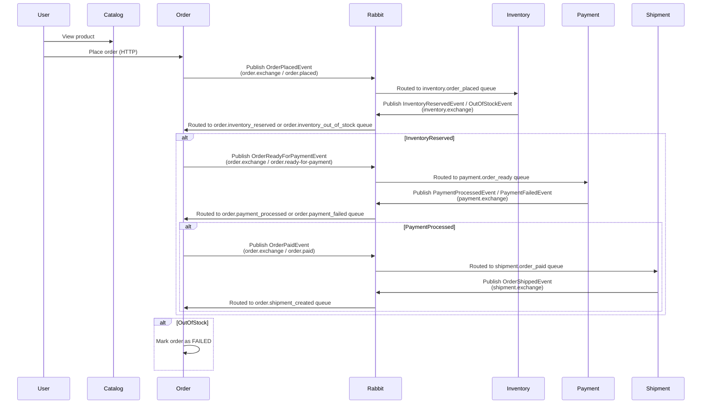

# 🛒 Distributed Online Store — Spring Boot + RabbitMQ + OpenTelemetry + Vector DB RAG

This project started as a demo **microservices-based online store** built with **Spring Boot**, **RabbitMQ**, and **OpenTelemetry**, and has grown into a full local sandbox for **observability-driven AI**: every trace produced by the store is embedded into **pgvector** and made queryable in plain English through a **Claude-powered RAG service**.

---

## 📦 Architecture Overview

The stack is organized into three logical clusters, all wired together by Docker Compose:

```
┌─ App cluster ───────────────────────────────────────────────────────────┐
│  catalog · order · inventory · payment · shipment  (Spring Boot/OTel)   │
│  postgres (pgvector)  ·  rabbitmq                                       │
└───────────────────────────────────────────────────────────────────────────┘
┌─ Observability cluster ────────────────────────────────────────────────┐
│  otel-collector · jaeger · tempo · prometheus · loki · grafana         │
└───────────────────────────────────────────────────────────────────────────┘
┌─ AI pipeline ───────────────────────────────────────────────────────────┐
│  telemetry-pipeline (OTel → pgvector)  ·  rag-service (Claude RAG)      │
└───────────────────────────────────────────────────────────────────────────┘
```

| Component              | Description                                                        |
|------------------------|----------------------------------------------------------------------|
| `catalog-service`      | Manages product catalog (name, price)                               |
| `order-service`        | Accepts orders and tracks status                                    |
| `inventory-service`    | Reserves product stock on order                                     |
| `payment-service`      | Simulates payment processing (configurable failure rate)            |
| `shipment-service`     | Simulates shipment creation                                         |
| `postgres` (pgvector)  | Per-service databases + a `telemetrydb` with a vector-indexed embeddings table |
| `rabbitmq`             | Async messaging backbone between the 5 services                     |
| `otel-collector`       | Receives OTLP traces/metrics and fans them out to the observability backends |
| `jaeger` / `tempo`     | Trace storage + UI                                                   |
| `prometheus` / `loki`  | Metrics and log storage                                              |
| `grafana`              | Dashboards over Prometheus/Tempo/Loki                                |
| `telemetry-pipeline`   | Polls Jaeger, embeds spans with `all-MiniLM-L6-v2`, writes to pgvector |
| `rag-service`          | FastAPI app: retrieves relevant spans from pgvector and answers questions via the Claude API |

All 5 store services communicate asynchronously using **RabbitMQ** with topic exchanges and routing keys. Traces are collected via **OpenTelemetry OTLP over gRPC** and fanned out to Jaeger/Tempo/Prometheus/Loki/Grafana — and, from there, into the vector DB / RAG pipeline described below.

---

## 🧭 Message Flow

The order workflow looks like this:



All messages are defined using clean, structured DTOs, and published via Spring's `RabbitTemplate`. Tracing headers are propagated automatically through RabbitMQ using OpenTelemetry and Micrometer.

---

## 📡 Messaging Overview

| Message                   | Sent By          | Consumed By         |
|---------------------------|------------------|----------------------|
| `OrderPlacedEvent`        | order-service     | inventory, payment   |
| `InventoryReservedEvent`  | inventory-service | order-service        |
| `InventoryOutOfStockEvent`| inventory-service | order-service        |
| `PaymentProcessedEvent`   | payment-service   | order-service        |
| `PaymentFailedEvent`      | payment-service   | order-service        |
| `OrderShippedEvent`       | shipment-service  | order-service        |

---

## 🕵️ Observability → Vector DB → RAG

Beyond distributed tracing, this project turns telemetry into a queryable knowledge base:

1. Each service is instrumented with the **OpenTelemetry Java Agent** and exports traces/metrics via **OTLP over gRPC** to the `otel-collector`.
2. The collector fans traces out to **Jaeger** and **Tempo**, metrics to **Prometheus**, and logs to **Loki** — all visualized in **Grafana**.
3. `telemetry-pipeline` (Python) polls Jaeger, converts spans into text, embeds them with `all-MiniLM-L6-v2`, and stores them in a `pgvector`-backed `telemetry_embeddings` table (HNSW cosine index) inside Postgres.
4. `rag-service` (Python/FastAPI) embeds an incoming question, retrieves the most relevant spans from pgvector, and asks the **Claude API** to answer using that context — exposed through a small demo UI.

This means you can ask things like *"are there any errors?"* or *"which service has the slowest operations?"* and get an answer grounded in the actual traces your services produced.

Access points:
- Jaeger UI: [http://localhost:16686](http://localhost:16686)
- Grafana: [http://localhost:3000](http://localhost:3000) (`admin` / `verysecret`)
- RAG demo UI: [http://localhost:8200](http://localhost:8200)
- Telemetry pipeline stats: [http://localhost:9000/stats](http://localhost:9000/stats)

---

## 🚀 Getting Started

### 🐳 Requirements

- Docker + Docker Compose (everything, including the Spring Boot services, builds and runs inside containers)
- An [Anthropic API key](https://console.anthropic.com/) for the RAG service
- ~6GB RAM available to Docker Desktop (the embedding model runs in two Python containers)

### 📁 Clone the Repo

```bash
git clone https://github.com/datmt/spring-microservices-rabbit-otel
```

### 🔑 Set your Claude API key

```bash
export ANTHROPIC_API_KEY=sk-ant-api03-...
```

On Windows (PowerShell):
```powershell
$env:ANTHROPIC_API_KEY = "sk-ant-api03-..."
```

### 🧰 Build and start everything

```bash
docker compose up --build
```

First build takes ~10-15 minutes (Maven build + Python model download). Subsequent starts take ~2-3 minutes.

> See [SETUP.md](SETUP.md) for a detailed step-by-step walkthrough, the full service/URL table, the architecture diagram, and troubleshooting tips.

---

## 🧪 Try the Flow

1. `docker compose up --build` and wait for all services to report healthy.
2. Hit the catalog and order APIs directly, or run the included load generator to produce a realistic, mixed traffic pattern (successful orders and categorized failures):
   ```bash
   ./scripts/load-test.sh
   ```
3. Watch traces appear in Jaeger/Grafana, and wait ~30s for `telemetry-pipeline` to index them (check `http://localhost:9000/stats`).
4. Open the RAG demo at [http://localhost:8200](http://localhost:8200) and ask questions about what happened, e.g.:
   - "Are there any errors?"
   - "Which service has the slowest operations?"
   - "Show me the order placement flow and timings"
   - "Give me a health summary of all services"

---

## 🧱 Project Structure

```
.
├── catalog-service/          # Spring Boot service
├── order-service/            # Spring Boot service
├── inventory-service/        # Spring Boot service
├── payment-service/          # Spring Boot service
├── shipment-service/         # Spring Boot service
├── common/                   # Shared DTOs and constants
├── postgres/init.sh          # Creates per-service DBs + pgvector + embeddings table
├── service-configs/          # Env-var-driven application.yaml per service, Grafana provisioning
├── telemetry-pipeline/       # Python: Jaeger → embeddings → pgvector
├── rag-service/              # Python FastAPI: Claude RAG + demo UI
├── scripts/load-test.sh      # Traffic generator for demo/telemetry data
├── docker-compose.yaml       # Full stack (app + observability + AI pipeline)
├── otel-collector-config.yaml
├── tempo-config.yaml
├── prometheus.yml
└── opentelemetry-javaagent.jar
```

---

## 📋 Notes

- Persistence has moved from in-memory stores to **Postgres** (one database per service, plus `telemetrydb` for embeddings).
- No authentication or customer service to keep services focused and isolated.
- Each store service is decoupled and communicates through events only; DTOs and messaging topics are shared via the `common` module.
- `PAYMENT_FAILURE_RATE` (env var, default `0.4`) controls how often payment-service simulates a decline, useful for generating error traces to query.

---

## 📖 Learn More

- [OpenTelemetry for Java](https://opentelemetry.io/docs/instrumentation/java/)
- [Jaeger Tracing](https://www.jaegertracing.io/)
- [Grafana Tempo](https://grafana.com/oss/tempo/)
- [Micrometer Tracing](https://micrometer.io/docs/tracing)
- [Spring AMQP](https://spring.io/projects/spring-amqp)
- [pgvector](https://github.com/pgvector/pgvector)
- [Claude API](https://docs.claude.com/)

---

## 📣 Contributions Welcome

Feel free to fork and extend this — more realistic failure scenarios, additional dashboards, or richer RAG retrieval strategies are all fair game.

---

## 📝 License

MIT
